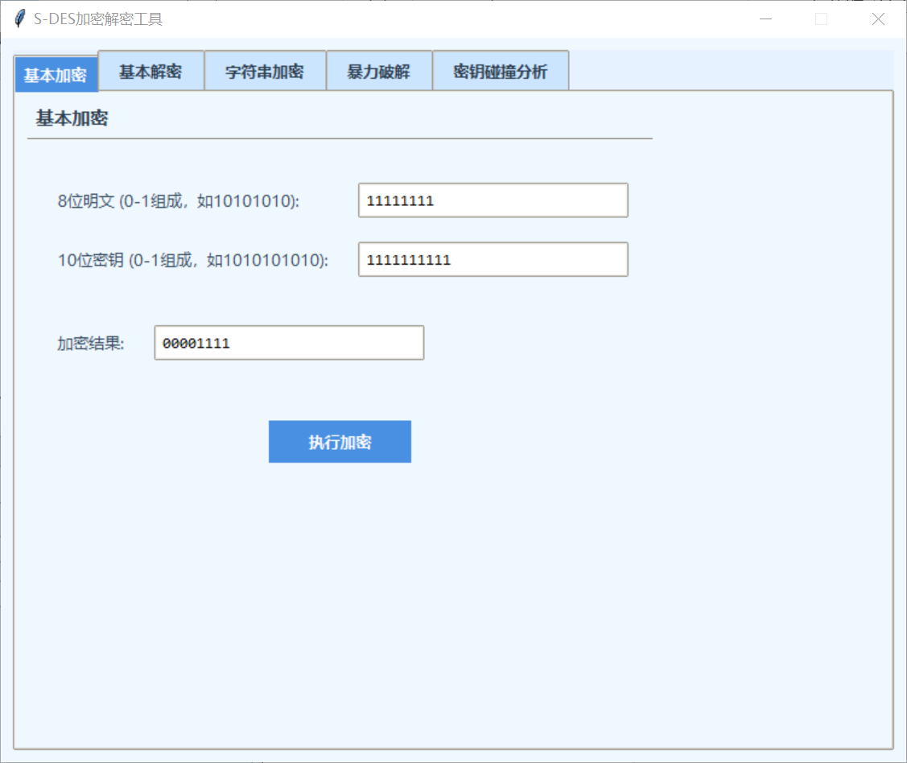
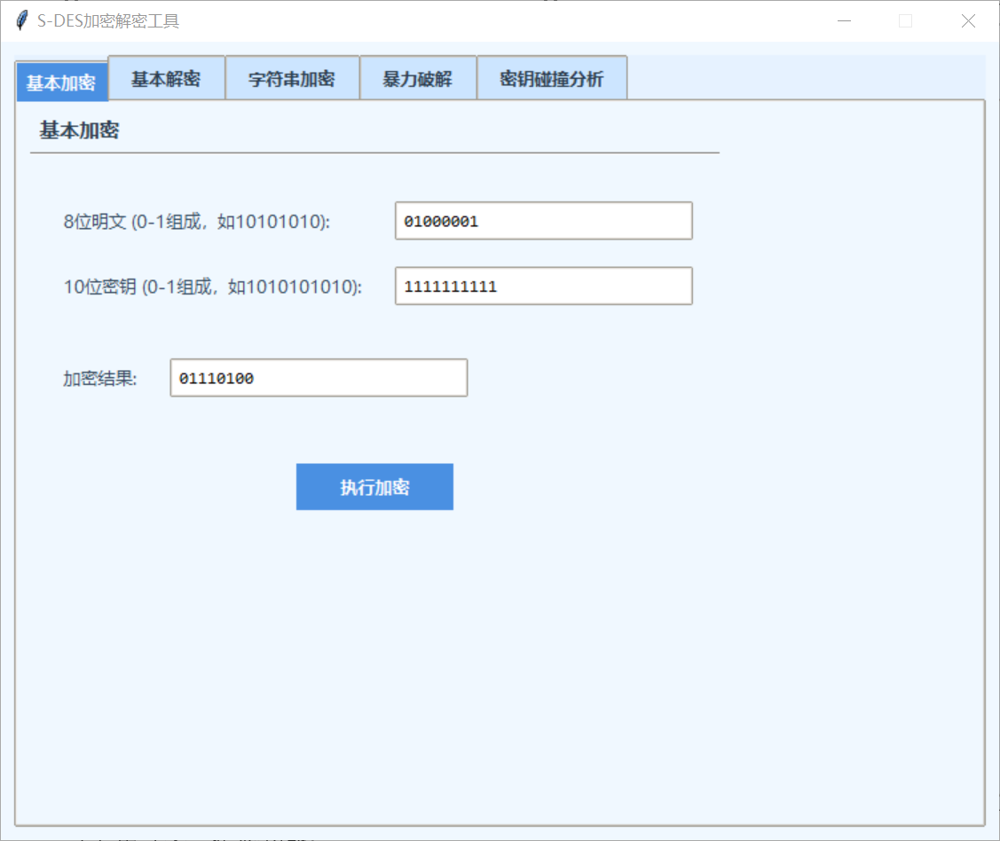
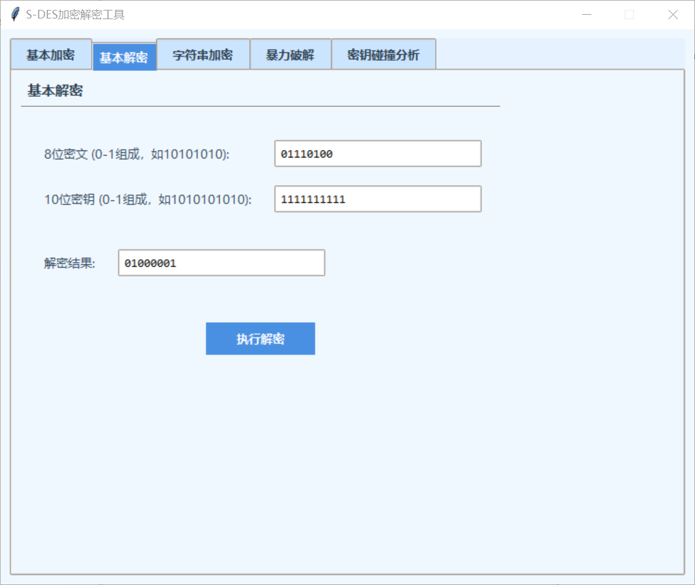
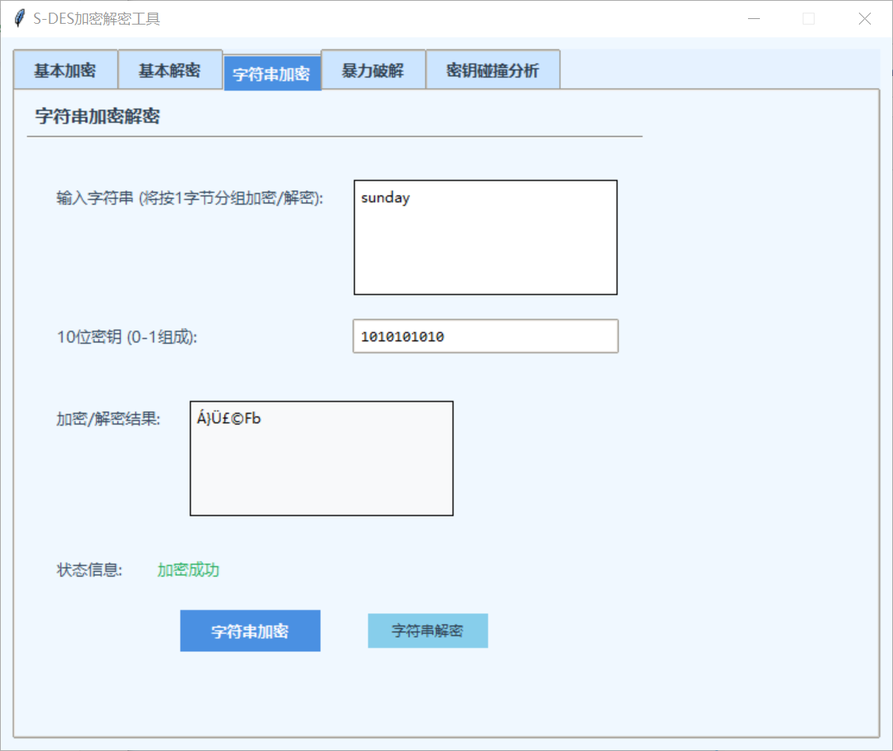
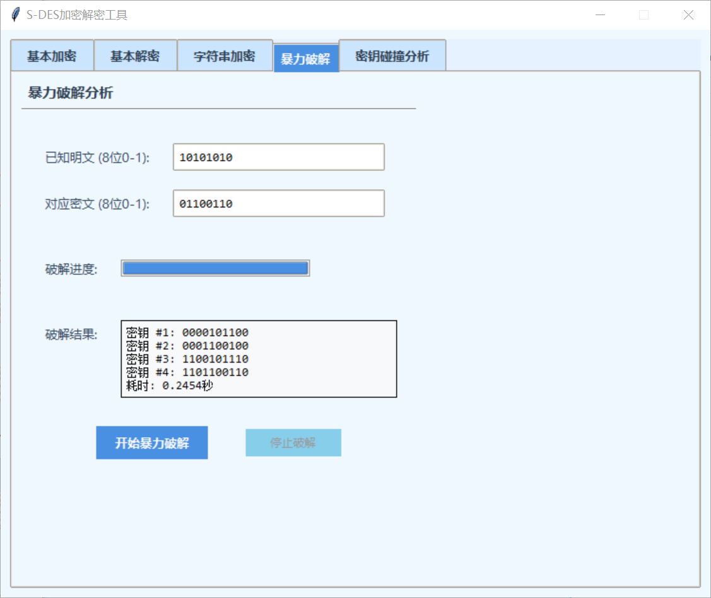
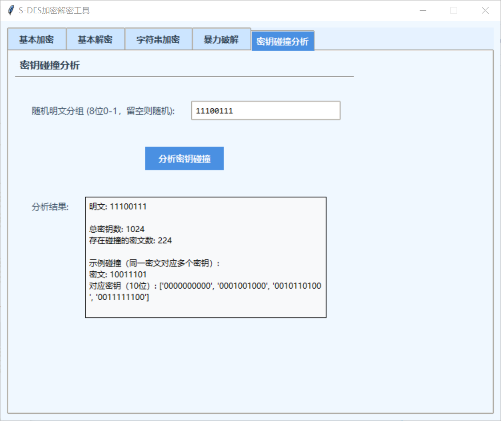

# 信息安全实验：S-DES 编程与测试

> 本 README 按实验文档整理，涵盖 5 个关卡（基本测试、交叉测试、扩展功能、暴力破解、封闭测试）。关卡目标与说明源自课程文档。  

## 目录
- [背景与目标](#背景与目标)
- [关卡一：基本测试](#关卡一基本测试)
- [关卡二：交叉测试](#关卡二交叉测试)
- [关卡三：扩展功能](#关卡三扩展功能)
- [关卡四：暴力破解](#关卡四暴力破解)
- [关卡五：封闭测试](#关卡五封闭测试)

---

## 背景与目标
根据 S-DES 算法编写和调试程序，提供 **GUI/交互** 支持。输入为 **8 bit 明文** 与 **10 bit 密钥**，输出为 **8 bit 密文**。 

---

## 关卡一：基本测试
**目标**  
- 实现 **基本加密** 与 **基本解密** 流程，验证明文↔密文的正确性。

---

## 关卡二：交叉测试
**目标**  
- 不同同学/小组在 **相同密钥 K** 下按 **一致的算法流程与转换单元**（P-Box、S-Box 等）实现程序，以保证**异构平台**可互通。
- A、B 两组对同一明文 P 加密得到相同密文 C，或 B 组可成功解出 A 组产生的密文 C，得到相同明文 P。
- 参考小组 “GOGOGO” 的加/解密结果应一致（作为示例对照）。

---

## 关卡三：扩展功能
**目标**  
- 将数据输入扩展为 **ASCII 字符串（按 1 Byte 分组）**，输出也可为 **ASCII 字符串**（可能是“乱码”，属正常现象）。

---

## 关卡四：暴力破解
**目标**  
- 在已知 **同一密钥** 的 **明/密文对**（一个或多个）前提下，尝试 **暴力枚举密钥空间** 找到正确密钥；可选用 **多线程** 提升效率，并以 **时间戳/视频或动图** 展示完成时长。

---

## 关卡五：封闭测试
**目标**  
- 基于关卡四结果进一步分析：对随机选取的 **一对明/密文**，是否 **存在不止一个密钥**？  
- 扩展讨论：在明文空间任取一明文分组，**是否存在不同密钥加密得到相同密文** 的情况？ 

---
